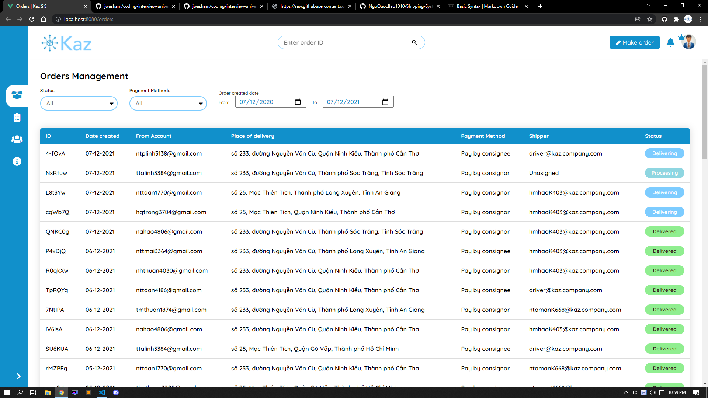
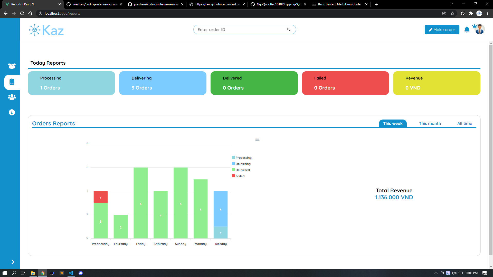
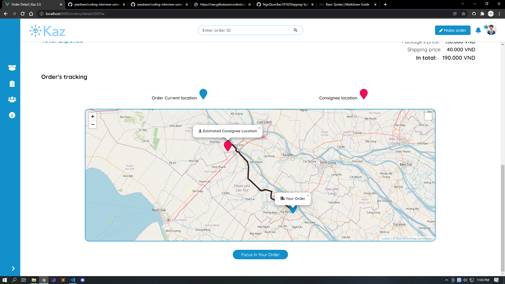
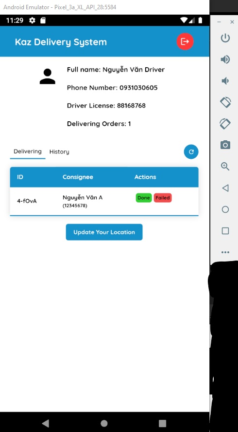

<div id="top"></div>

<!-- PROJECT LOGO -->
<br />
<div align="center">
  <a href="#">
    
  </a>

  <h3 align="center">Kaz Delivery Management System</h3>

  <p align="center">
    A Kaz delivery management system provides basis functional for a delivery company
  </p>
</div>


<!-- TABLE OF CONTENTS -->
<details>
  <summary>Table of Contents</summary>
  <ol>
    <li>
      <a href="#about-the-project">About The Project</a>
      <ul>
        <li><a href="#built-with">Built With</a></li>
      </ul>
    </li>
    <li>
      <a href="#getting-started">Getting Started</a>
      <ul>
        <li><a href="#prerequisites">Prerequisites</a></li>
        <li><a href="#installation">Installation</a></li>
      </ul>
    </li>
    <li><a href="#usage">Usage</a></li>
    <li><a href="#contributing">Contributing</a></li>
    <li><a href="#contact">Contact</a></li>
    <li><a href="#acknowledgments">Acknowledgments</a></li>
  </ol>
</details>


<!-- ABOUT THE PROJECT -->
## About The Project

This project is actually for my prepration thesis from Can Tho University. This is a management system for a delivery company. There are a lot of fundamental functionalities that implemented in order for a delivey company to manage their orders.

Here are some of the basis required feature:
* Orders Management (status, date created, ...)
<P align="center"></p>

* Statiscal and Financial Report 💲
<P align="center"></p>

* Order tracking 🚚 (implement Leaflet Routing Machine)
<P align="center"></p>

Although the application is mainly built just for a manager of the company to manage the orders. I also built some additional functionalities for customers to use the system and a mobile version for the drivers of the company to demonstrate how the tracking order's location
functionality work.
Here's a brief look of the mobile version 📱:
<P align="center"></p>


<p align="right">(<a href="#top">back to top</a>)</p>


### Built With

For front end (including Mobile)
* [Vue.js v2](https://vuejs.org/)
* [Quasar.js v1](https://vuejs.org/)

For the backend API
* [Python](https://python.org/)
* [Django](https://docs.djangoproject.com/)
* [Django Rest Framework](https://www.django-rest-framework.org/)


<p align="right">(<a href="#top">back to top</a>)</p>


<!-- GETTING STARTED -->
## Getting Started

This is an example of how you may give instructions on setting up your project locally.
To get a local copy up and running follow these simple example steps.

### Prerequisites

For the web application to work, you only need to focus on the backend and the shipping-system folder.

### Installation


1. Clone the repo and change to that folder
   ```sh
   git clone https://github.com/NgoQuocBao1010/Shipping-System-Management.git
   ```

2. Install packages for the backend
    * Change folder to backend folder
      ```sh
      cd backend

      pip install -r requirements.txt
      ```
    
    * Create certificate for Django to update Django localhost to HTTPS: Follow this [instruction](https://timonweb.com/django/https-django-development-server-ssl-certificate/). (You can take a look at my folder for reference)

    * Run the HTTPS server
      ```sh
        cd src

        python manage.py runserver_plus --cert-file cert.pem --key-file key.pem
      ```


3. Install packages for the frontend
    * Change folder to shippping-system and install packages via npm
      ```sh
      cd shipping-system

      npm install
      ```
    * Get a free API Key for OpenRouteService (API for calculating distance between 2 locations) at [their website](https://openrouteservice.org/dev/#/home).

    * Update the API in "./shipping-system/src/api/routing/location.js"
      ```js
      const OPENSERVICE_API_KEY =
      "YOUR_API_KEY";
      ```
    
    * Run the frontend server
      ```sh
      npm run serve
      ```

<p align="right">(<a href="#top">back to top</a>)</p>


<!-- USAGE EXAMPLES -->
## Usage

As the introduction indicated, the main purpose of this project is for delivery management, after the installation successfully, you can exploring around the application to enjoy all of its functionalities.


<p align="right">(<a href="#top">back to top</a>)</p>


<!-- CONTRIBUTING -->
## Contributing

Contributions are what make the open source community such an amazing place to learn, inspire, and create. Any contributions you make are **greatly appreciated**.

If you have a suggestion that would make this better, please fork the repo and create a pull request. You can also simply open an issue with the tag "enhancement".
Don't forget to give the project a star! Thanks again!

1. Fork the Project
2. Create your Feature Branch (`git checkout -b feature/AmazingFeature`)
3. Commit your Changes (`git commit -m 'Add some AmazingFeature'`)
4. Push to the Branch (`git push origin feature/AmazingFeature`)
5. Open a Pull Request

<p align="right">(<a href="#top">back to top</a>)</p>


<!-- LICENSE -->
## License

Distributed under the MIT License.

<p align="right">(<a href="#top">back to top</a>)</p>


<!-- CONTACT -->
## Contact

Ngô Hồng Quốc Bảo - [@NgoQuocBao](https://twitter.com/ngohquocbao1010)

Project Link: [https://github.com/NgoQuocBao1010/Shipping-System-Management](https://github.com/NgoQuocBao1010/Shipping-System-Management)

<p align="right">(<a href="#top">back to top</a>)</p>


<!-- ACKNOWLEDGMENTS -->
## Acknowledgments
This awesome README temaplate is from [Best README Template](https://github.com/othneildrew/Best-README-Template). ♥

<p align="right">(<a href="#top">back to top</a>)</p>
